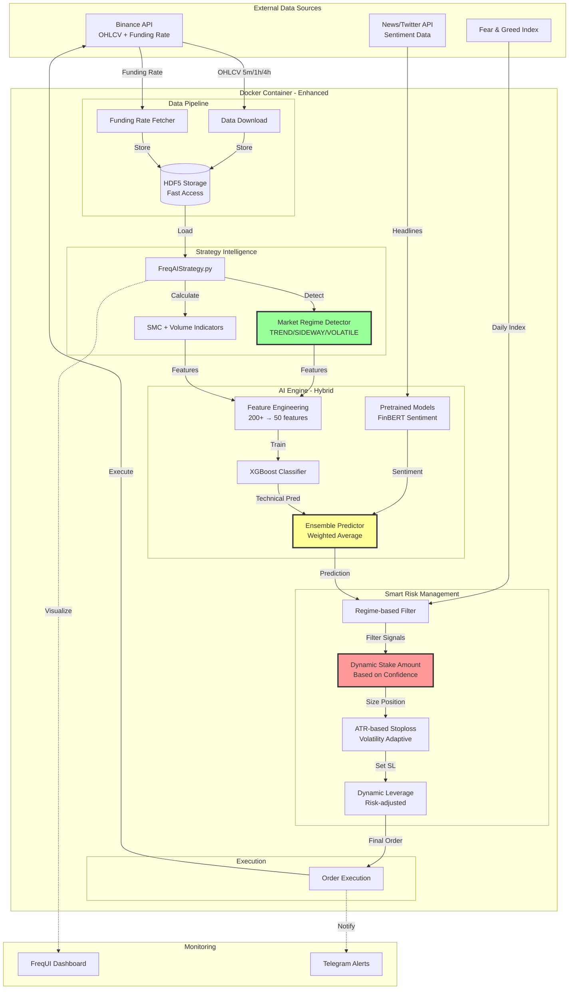
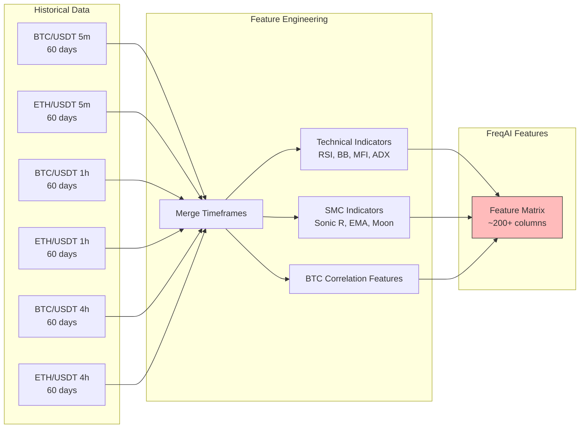
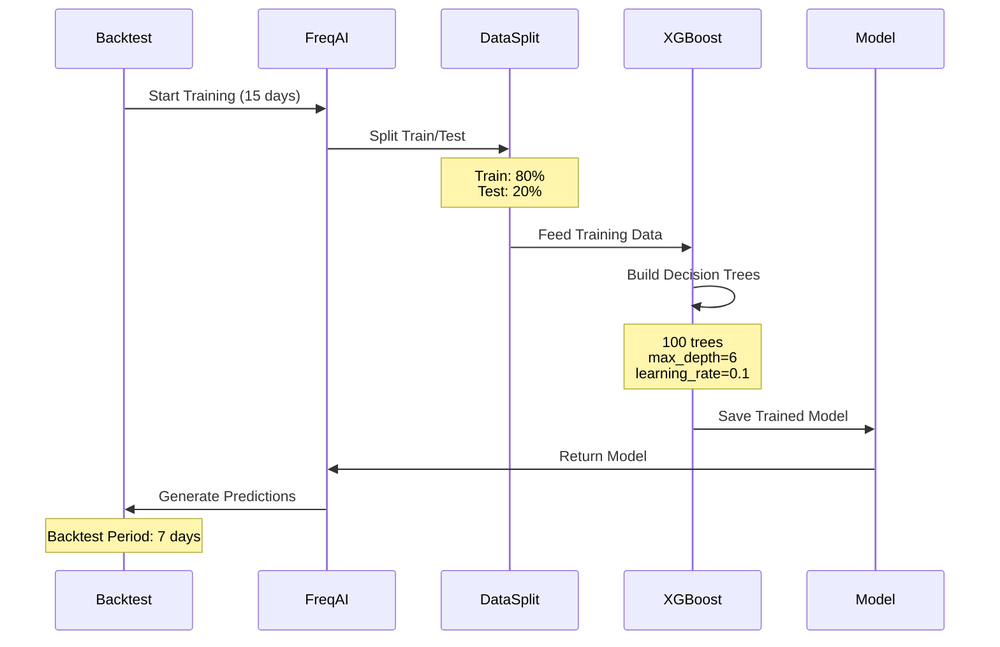
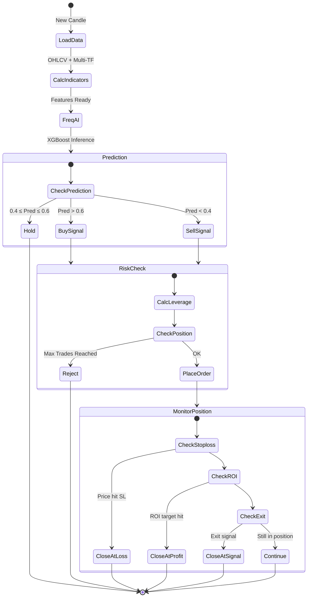
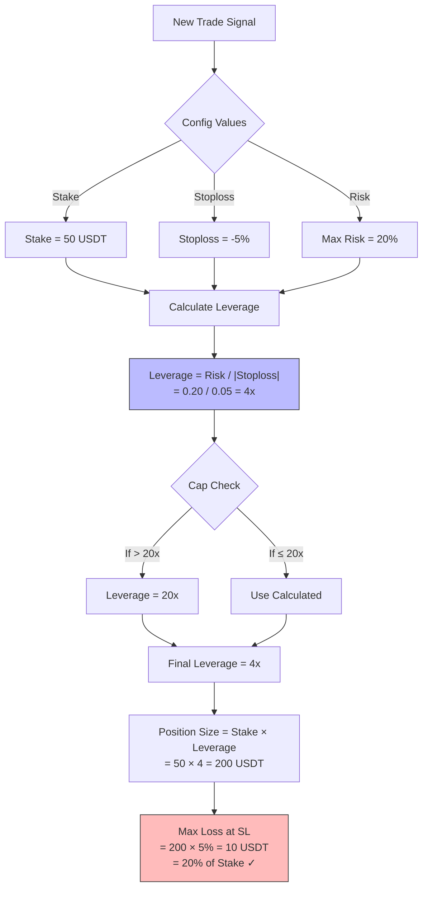
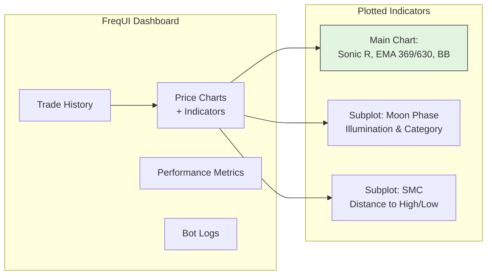

# AI Trading System - Architecture Documentation

## 1. Overview

Hệ thống AI Trading này sử dụng **Freqtrade** kết hợp **FreqAI** để thực hiện giao dịch tự động trên thị trường Crypto Futures. Hệ thống bao gồm các thành phần chính: Data Layer, Feature Engineering, AI Model Training, Strategy Execution, và Risk Management.

## 2. Enhanced High-Level Architecture



### Key Enhancements:
1. **🎯 Market Regime Detection** - Filters trades based on market condition
2. **💪 Hybrid AI** - Combines XGBoost + Pretrained FinBERT
3. **⚖️ Dynamic Risk** - Stake, Stoploss, and Leverage adapt in real-time
4. **📊 Rich Data** - Funding Rate, Sentiment, Fear & Greed Index

## 3. Data Flow Architecture

### 3.1 Multi-Timeframe Data Pipeline



### 3.2 Feature Engineering Detail

```mermaid
graph TD
    subgraph "Raw OHLCV"
        O[Open]
        H[High]
        L[Low]
        C[Close]
        V[Volume]
    end
    
    subgraph "expand_all<br/>(Multi-TF, Shifted)"
        RSI[RSI 14]
        BB[Bollinger Bands]
        MFI[Money Flow Index]
        ADX[ADX 14]
        Sonic[Sonic R Dragon Lines]
        EMA[EMA 369/630]
        Moon[Moon Phase Features]
        SMC[SMC Distance to High/Low]
    end
    
    subgraph "expand_basic"
        PctChange[% Change]
        RawPrice[Raw Price]
    end
    
    subgraph "standard<br/>(Normalization)"
        Norm[Min-Max Scaling]
    end
    
    subgraph "Target"
        Target["Target: Price in 20 candles<br/>(0 or 1 for up/down)"]
    end
    
    O & H & L & C & V --> RSI & BB & MFI & ADX & Sonic & EMA & Moon & SMC
    RSI & BB & MFI & ADX & Sonic & EMA & Moon & SMC --> PctChange & RawPrice
    PctChange & RawPrice --> Norm
    Norm --> Target
    
    style Target fill:#bfb,stroke:#333
```

**Chi tiết các features:**
- **expand_all**: Mỗi indicator được tính cho 3 timeframes (5m, 1h, 4h) × 3 shifted candles × 2 pairs (BTC, ETH) = ~180 features
- **expand_basic**: Thêm raw values và % change
- **standard**: Chuẩn hóa dữ liệu về khoảng [0, 1]
- **Target**: AI học dự đoán giá sẽ tăng hay giảm sau 20 candles

## 4. FreqAI Training Pipeline



**Chu trình Training:**
1. **Rolling Window**: Mỗi 15 ngày, model được train lại
2. **Backtest Period**: Test model trong 7 ngày tiếp theo
3. **Model Storage**: Model được lưu tại `user_data/models/freqai-xgboost/`

## 5. Strategy Execution Flow



## 6. Risk Management & Leverage Calculation

### 6.1 Position Sizing Logic



### 6.2 Ví dụ thực tế

**Scenario 1: Vào lệnh LONG BTC/USDT**
- **Entry Price**: 40,000 USDT
- **Stake**: 50 USDT (margin)
- **Leverage**: 4x
- **Position Size**: 200 USDT (0.005 BTC)
- **Stoploss**: -5% → 38,000 USDT

**Nếu chạm Stoploss:**
- Loss = (40,000 - 38,000) / 40,000 = 5%
- Loss in USDT = 200 × 5% = **10 USDT**
- % of Margin = 10 / 50 = **20%** ✓

**Scenario 2: Profit tại ROI 5%**
- Exit Price: 42,000 USDT
- Profit = 200 × 5% = **10 USDT**
- % of Margin = 10 / 50 = **20%** profit

## 7. Component Details

### 7.1 File Structure

```
trading/
├── docker-compose.yml          # Docker orchestration
├── Dockerfile                  # Custom image with XGBoost
├── Makefile                    # Shortcuts (make start, make stop)
├── docs/
│   ├── trains/
│   │   └── advanced_ai_architecture.md
│   └── architecture.md         # This file
├── user_data/
│   ├── config.json            # Main configuration
│   ├── data/binance/          # Downloaded OHLCV data
│   ├── models/                # Trained AI models
│   └── strategies/
│       ├── FreqAIStrategy.py  # Main strategy
│       ├── BasicStrategy.py   # Backup strategy
│       └── indicators/
│           └── smc_indicators.py  # Custom indicators
```

### 7.2 Key Configuration Parameters

**config.json highlights:**
```json
{
  "stake_amount": 50,           // 50 USDT per trade
  "trading_mode": "futures",    // Futures trading
  "margin_mode": "isolated",    // Isolated margin
  "max_open_trades": 3,         // Max 3 concurrent positions
  "freqai": {
    "enabled": true,
    "train_period_days": 15,    // Retrain every 15 days
    "backtest_period_days": 7,  // Test on 7 days
    "include_timeframes": ["5m", "1h", "4h"],
    "include_corr_pairlist": ["BTC/USDT"]
  }
}
```

## 8. Monitoring & Visualization



**Access FreqUI**: http://127.0.0.1:8080

## 9. Next Steps: Hyperopt

Hyperopt sẽ tối ưu các tham số sau:

1. **Entry/Exit Thresholds**:
   - Ngưỡng dự đoán để vào lệnh (hiện tại: 0.6)
   - Ngưỡng để thoát lệnh (hiện tại: 0.4)

2. **ROI Levels**:
   - Mức profit để tự động chốt lời

3. **Stoploss**:
   - Mức cắt lỗ tối ưu (ảnh hưởng đến leverage)

**Command**:
```bash
docker compose run --rm freqtrade hyperopt \
  --strategy FreqAIStrategy \
  --hyperopt-loss SharpeHyperOptLoss \
  --spaces buy sell roi stoploss \
  --epochs 100
```
