# FreqAI Training Cycle

## Overview

Diagram showing how FreqAI continuously trains and adapts models to changing market conditions.

```mermaid
%%{init: {'theme': 'dark', 'themeVariables': { 'primaryColor': '#1e88e5', 'primaryTextColor': '#fff', 'primaryBorderColor': '#42a5f5', 'lineColor': '#90caf9', 'secondaryColor': '#424242', 'tertiaryColor': '#2d2d2d'}}}%%
flowchart TB
    subgraph Training["🔄 FreqAI Training Cycle"]
        direction TB
        A[("📊 Market Data<br/>OHLCV + Volume")] --> B["🔧 Feature Engineering<br/>• Technical Indicators<br/>• SMC Features<br/>• Multi-timeframe"]
        B --> C["🧠 ML Model Training<br/>XGBoost/LightGBM"]
        C --> D[("💾 Save Model<br/>user_data/models/")]
        D --> E{"⏰ Retrain Timer<br/>live_retrain_hours"}
        E -->|"Time passed"| A
        E -->|"Still valid"| F
    end

    subgraph Live["📈 Live Trading"]
        direction TB
        F["📥 Load Model"] --> G["🔮 Predict Price"]
        G --> H{"Signal?"}
        H -->|"Bullish"| I["🟢 LONG Entry"]
        H -->|"Bearish"| J["🔴 SHORT Entry"]
        H -->|"Neutral"| K["⏸️ Hold"]
    end

    subgraph Hyperopt["⚙️ Hyperopt - Find Best Strategy"]
        direction TB
        L["🎯 Define Search Space<br/>ROI, Stoploss, Indicators"] --> M["🔁 Run 1000+ Trials"]
        M --> N["📊 Evaluate Performance<br/>Profit, Sharpe, Drawdown"]
        N --> O["✅ Best Parameters<br/>Save to config"]
    end

    Training --> Live
    Hyperopt -.->|"Optimize strategy"| Training
```



## Model Storage Location

```
user_data/models/
├── FreqAIStrategy/
│   ├── sub-train-BTC_USDT_USDT-{date}/
│   │   ├── model.joblib          ← Trained model
│   │   ├── metadata.json         ← Training info
│   │   └── features.json         ← Feature list
│   └── sub-train-ETH_USDT_USDT-{date}/
```

## Why Continuous Training?

1. **History repeats itself** - Market patterns are cyclical, but the model needs fresh data to recognize current cycle phase
2. **Regime detection** - Bull/bear/sideways markets have different characteristics - model learns which regime we're in
3. **Recent data weighting** - More recent patterns are more relevant for immediate predictions
4. **Pattern recognition** - Model learns to identify recurring patterns (support/resistance, liquidity zones) from latest price action
