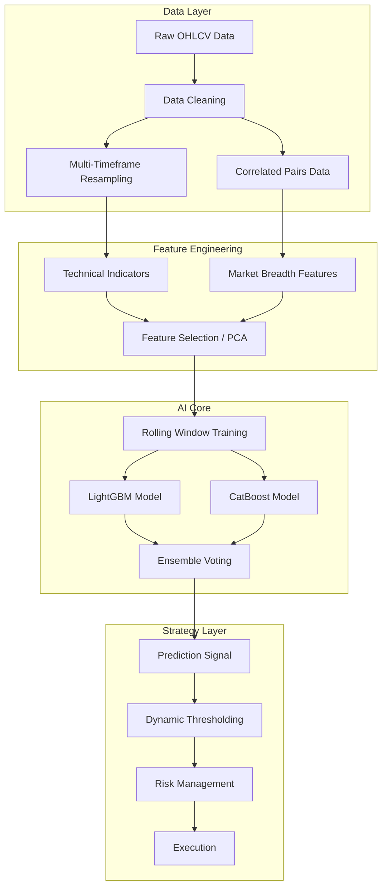

# Advanced AI Trading Architecture

## 1. Overview
Tài liệu này mô tả kiến trúc hệ thống AI Trading nâng cao, nhằm khắc phục các hạn chế của mô hình cơ bản (Basic XGBoost). Mục tiêu là xây dựng một hệ thống "thông minh" hơn, có khả năng thích ứng với biến động thị trường và giảm thiểu tín hiệu nhiễu.

## 2. Architecture Diagram

## 3. Key Components

### 3.1. Data Layer (Dữ liệu)
*   **Multi-Timeframe**: Không chỉ nhìn nến 5m. Model cần "hiểu" xu hướng lớn ở nến 1h, 4h và xu hướng nhỏ ở 1m.
*   **Correlated Pairs**: Thêm dữ liệu của BTC (nếu trade Altcoin) hoặc ETH để model nhận biết xu hướng chung của thị trường (Market Sentiment).
*   **Noise Reduction**: Áp dụng Heikin Ashi hoặc lọc nhiễu trước khi đưa vào model.

### 3.2. Feature Engineering (Xử lý đặc trưng)
*   **Lag Features**: Giá của 1, 2, 3, 5, 8 nến trước.
*   **Rolling Statistics**: Mean, Std, Max, Min trong cửa sổ 20, 50, 100 nến.
*   **Cycle Indicators**: Hilbert Transform, Homodyne Discriminator để bắt chu kỳ thị trường.
*   **Feature Selection**: Dùng Recursive Feature Elimination (RFE) hoặc Permutation Importance để loại bỏ features rác gây nhiễu.

### 3.3. AI Core (Mô hình)
*   **Model**: Chuyển sang **CatBoost** (xử lý tốt nhiễu và categorical features) hoặc **XGBoost** với cây sâu hơn (deeper trees).
*   **Ensemble**: Kết hợp dự đoán của nhiều model (ví dụ: 1 model chuyên bắt trend, 1 model chuyên bắt sideway).
*   **Hyperparameter Tuning**: Sử dụng thư viện `optuna` để tự động tìm tham số tối ưu (Learning rate, Depth, L2 regularization).

### 3.4. Strategy Layer (Chiến thuật)
*   **Dynamic Thresholds**: Thay vì fix cứng ngưỡng vào lệnh là 0.6, ngưỡng này sẽ thay đổi theo độ biến động (ATR). Ví dụ: Thị trường biến động mạnh -> Tăng ngưỡng an toàn lên 0.7.
*   **Confluence**: Chỉ vào lệnh khi AI đồng thuận với một chỉ báo kỹ thuật cổ điển (ví dụ: AI báo Tăng + Giá nằm trên EMA 200).

## 4. Training Strategy (Chiến lược huấn luyện)

### 4.1. Rolling Window (Cửa sổ trượt)
Thị trường Crypto thay đổi liên tục. Model train trên dữ liệu năm 2020 sẽ không hoạt động tốt năm 2025.
*   **Giải pháp**: Train lại model định kỳ (ví dụ: mỗi tuần).
*   **Train Period**: 30-60 ngày gần nhất.
*   **Backtest Period**: 7 ngày tiếp theo.

### 4.2. Target Engineering (Định nghĩa mục tiêu)
Thay vì chỉ dự đoán "Giá lên hay xuống" (Binary Classification), hãy dự đoán:
*   **Regression**: Giá sẽ tăng bao nhiêu %?
*   **Multi-class**: Tăng mạnh / Tăng nhẹ / Sideway / Giảm nhẹ / Giảm mạnh.

## 5. Implementation Roadmap

1.  **Nâng cấp Data**: Cấu hình `config.json` để tải thêm dữ liệu các khung giờ lớn.
2.  **Code Features mới**: Cập nhật `FreqAIStrategy.py` thêm các hàm `feature_engineering_expand_all` phức tạp hơn.
3.  **Tích hợp CatBoost**: Cài đặt thêm thư viện và cấu hình.
4.  **Chạy Hyperopt**: Tìm bộ tham số tốt nhất cho model.
